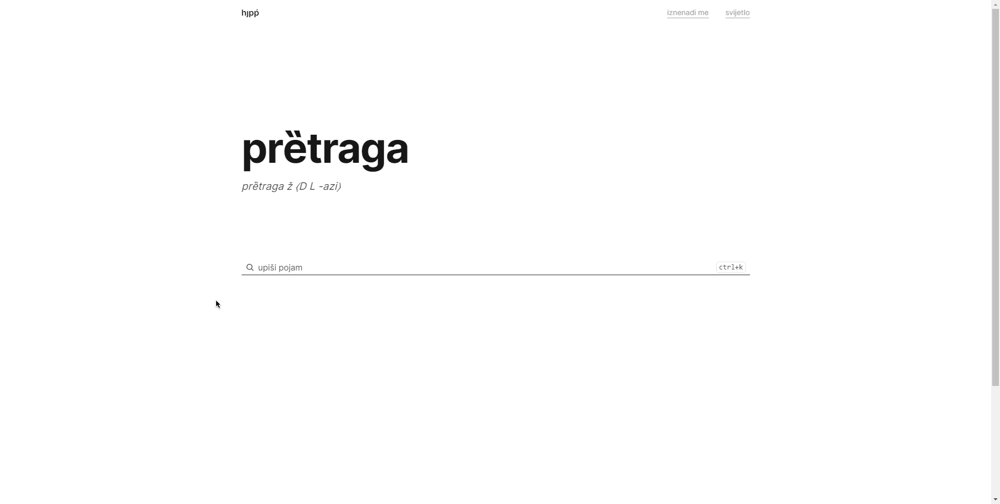
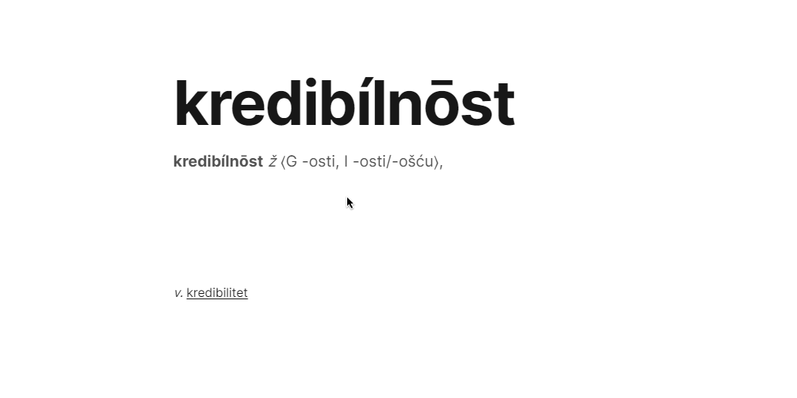

# hȷpṕ\*

[Live site](https://hjpp.vercel.app/)

\*HJP Plus - Hrvatski jezični portal plus (stylized as hȷpṕ)

## Description

Better version of [HJP](https://hjp.znanje.hr/index.php) mainly for personal use.

> This is a personal project, not affiliated with [HJP](https://hjp.znanje.hr/index.php), their work is amazing and I'm just trying to build better UI for it.

## Features

- Very fast / accurate search (using [Meilisearch](https://meilisearch.com/))
- Modern UI
- Dark mode
- Definition preview
  

## Project

### Scraper

Scraper retrives all pages from HJP, parses them and saves them to a single json file. Also uses [Piscina](https://github.com/piscinajs/piscina) to run multiple workers in parallel, since there are around 116k pages to scrape.

It can be used as standalone tool to scrape HJP.

[More info](./scraper/readme.md)

### App

Simple [Next.js](https://nextjs.org/) 13 app that uses [Meilisearch](https://meilisearch.com/) to search through scraped data.

By using the new React server components static data (word definition) is fetched on the server and cached.
